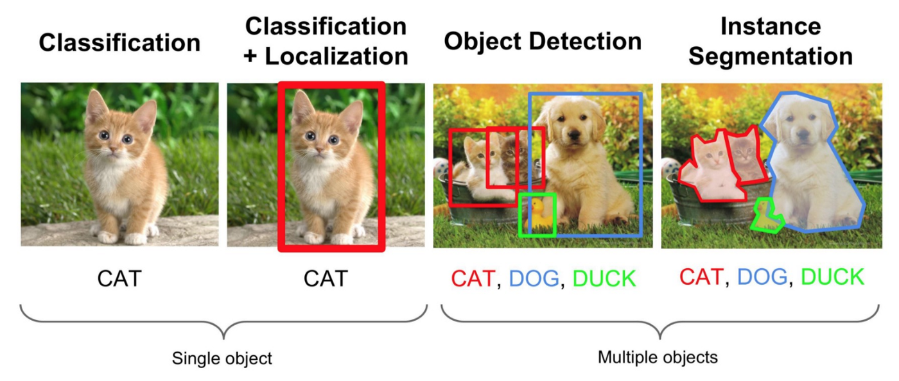
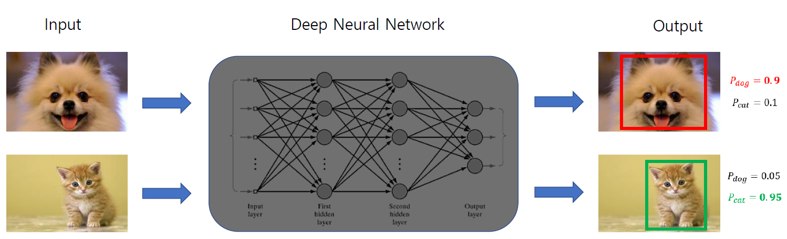
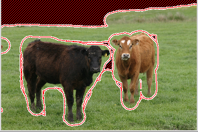
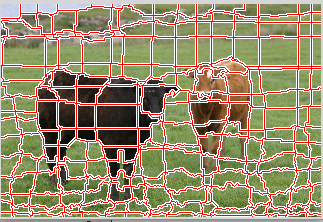
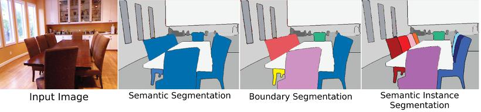
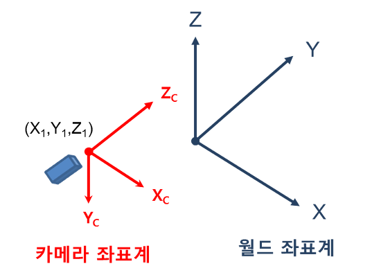
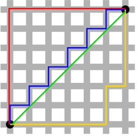
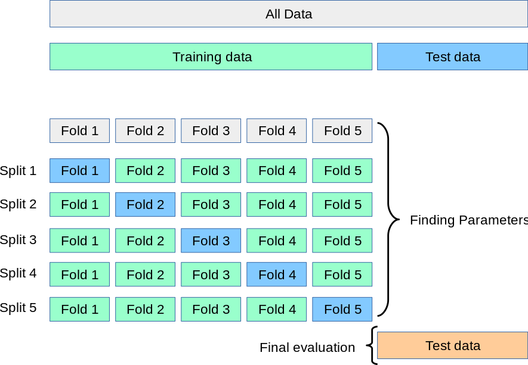

# 스터디 1주차

- [Lecture 1](#-lecture-1)
- [Lecture 2](#-lecture-2)

## Lecture 1

#### ✅ `소현` Image Segmentation, Image Detection, Object Recognition, Image Captioning 등 컴퓨터 비전 분야에 대해 정리해보자. (엄청 깊게는 아니고 각 분야의 차이 정도)

[딥러닝 객체 검출 용어 정리 Deep learning Object detection terminology [1]](https://light-tree.tistory.com/75)

- 대표적인 문제들을 정리한 사진 참고

  

- **Classification** : 이미지 안의 객체가 어떤 종류인지 라벨링하는 것
- **Localization** : 이미지 안의 객체가 어느 위치에 있는지 위치 정보를 출력해주는 것으로 주로 Bounding Box를 많이 사용하며 Bounding Box의 `left top` 혹은 `right bottom` 좌표를 출력한다.
- **Object Detection** : `Classification + Localization` 이 동시에 수행되는 것. 학습 목적에 따라 특정 객체만 찾는 경우도 있고 여러 개의 객체를 검출하는 경우도 있다. **Object Recognition**과 용어가 혼용하여 쓰인다. 그러나 가끔 Detection을 객체의 존재 유무만을 의미하고 Recognition을 객체의 종류를 아는 것이라 해석하여 Object Recognition을 더 큰 범위로 해석하는 경우도 있다.

  

- **Object Segmentation** : Object Detection을 통해 검출된 객체의 형상을 따라 객체의 영역을 표시하는 것을 말한다. 예를 들어 객체와 배경을 구분하기 위한 용도로 사용된다.

  

- **Image Segmentation** : 말 그대로 이미지를 분할하는 것이다. 이렇게 분할된 영역들을 알고리즘을 통해 합쳐서 Object Segmentation을 수행한다.

  

  - **Semantic Segmentation** : Object Segmentation을 하되 같은 class인 객체들을 같은 영역 혹은 색으로 분할하는 것
  - **Instance Segmentation** : 같은 class이더라도 서로 다른 instance들을 구분해주는 것이다.

  

- **Image Captioning** : 어떤 이미지를 설명하는 문장을 만들어 내는 것.

 

## Lecture 2

#### ✅ `세연` `p11` occlusion 같은 경우는 사람도 알아보기 힘들 것 같은데 애초에 대부분이 가려진 대상을 인식할 수 있는 방법이 있을지 궁금합니다.

- 개인적으로 더 공부를 해야할 부분인 것 같습니다.
- 아래 링크에 들어가면 가려진 물체를 인식했는지에 대한 결과가 나오는데 어떻게 한지는 논문을읽어봐야할 것 같습니다.

[Occlusion Reasoning for Object Detectionunder Arbitrary Viewpoint - IEEE Journals & Magazine](https://ieeexplore.ieee.org/abstract/document/6727481)

#### ✅ `소현` `p15` 명시적인 규칙이 정확히 무엇인가? 예를 들으면, 고양이의 귀를 인식한다고 할 때 코너가 2개 존재하고 직선 여러 개로 이루어져 있다. 이런 규칙을 말하는가?

인식(Recognition)을 위해서 Edge가 중요하다는 것을 안다. 그래서 Edge를 따고 그 모든 corners와 boundaries를 모두 카테고리화를 한다. 그러면 예를 들어 "귀는 3개의 코너와 이러이러하게 구성되어 있다" 즉, 이런 corner와 boundary의 집합을 카테고리화하는 것이다. 이런 것을 규칙이라 보면 된다.

하지만 이러한 방법은 "확작성"이 없다. 수십만 개의 객체에 대한 모든 Edge들을 카테고리화해야하기 때문에 좋은 방법은 아니다. 그래서 데이터 중심 접근방법이 중요하다!

#### ✅ `소현` `p28` 하얀 색 부분이 “KNN이 대다수를 결정할 수 없는 지역”이라 했는데 이 의미는 무엇을 뜻하는가?

> “The white regions are where there was no majority among the k-nearest neighbors”

가장 가까운 이웃이 존재하지 않으면 단순히 흰색으로 칠한다고 한다. 임계값이 있나 싶지만 상관이 없다고 생각하는데.. K=5이면 5개의 점을 찾고 칠하면 되는 것이 아닌가? 굳이 하얀색이어야 하는 이유가 뭘까?

아 투표를 많이 받은 라벨이 여러 개 있는 경우라고 한다. 예를 들어, K=5인데 빨간색 점 1개, 초록색 점 2개, 파란색 점 2개이면 뭐라 분류할 수가 없으므로 하얀색으로 둔다고 한다.

#### ✅ `소현` `p26` KNN은 학습데이터를 활용하여 공간을 분할한다고 했는데 알고리즘 상으로 보면 공간을 분류하기 보다는 단순 라벨링을 하는 듯한데 공간은 어떻게 분할하나요? 공간을 분할해야 후에 테스트 데이터셋을 활용해 라벨링을 할 수 있으니까 공간을 분할한다는 이유를 알겠는데 그 과정이 궁금합니다.

실제 코드를 보았는데 저건 완전 단순한 방법. 그냥 K=1로 해서 가장 가까운 거 찾아서 분류하는 것. 실제로는 저렇게 안함. K=1에 대한 알고리즘을 보고 KNN 알고리즘의 모든 것이라 생각해서 생긴 오해.

#### ✅ `소현` `p31` “L1거리는 좌표시스템에 따라 달라진다. 기존 좌표계를 회전시키면 L1거리가 변한다. 반면 L2거리는 변하지 않는다.” 이유가 궁금합니다. 이 성질로 인해서 L1거리는 특징벡터에서 주로 활용하는 것 같고 L2는 일반 벡터에서 활용하는 것 같습니다. 좌표축 영향을 받는가, 안 받는가의 차이가 잘 이해되지 않습니다.

#### ✅ `혜지` `p31` L1 이 어떤 좌표 시스템인지에 따라 많은 영향을 받는 다는 말이 이해가 안감

#### ✅ `세연` `p43` 아래 이미지 3개와 맨 왼쪽 이미지 간의 L2 distance가 같아서 distance metric이 이미지 간 유사도를 잘 포착하지 못한다고 했는데, L1은 어떤지 궁금합니다.

우선 좌표계 회전(변환)이 무엇인지 알아보자. 우선 좌표계라는 게 항상 보는 시점에 따라서 달라질 수 있다. 예를 들어, 월드좌표계(우리가 흔히 아는 `x` , `y` , `z` 좌표계)에 **어떤 물체**가 있다고 하자. 그리고 어떤 카메라가 있는데 이 카메라는 월드 좌표계를 기준으로 `(X1, Y1, Z1)` 지점에 위치해 있다고 할 때 다음과 같은 그림을 띨 것이다. 이 때 카메라는 `(Xc, Yc, Zc)` 좌표계를 가지고 있다고 하자.

그럼 카메라 좌표계가 바라봤을 때 **물체**는 어디에 있을까? 우선 우리가 월드 좌표계를 카메라 좌표계로 변환하기 위해서 다음과 같은 과정을 거쳐야 한다.

1. `(-X1, -Y1, -Z1)` 만큼 이동(Translate)하고
2. 각 축에 대해서 회전을 해주어야 한다.

그러면 카메라 좌표계로 나타낼 수 있다. 이렇게 되었을 때 각 점의 위치가 동일할까? 해당 위치가 아마 조금씩 바뀌었을 것이다. 그럼 각 점 사이의 `L1` 과 `L2` 거리를 한 번 생각해보자.

우선 빨간색이 `L1` 이고 초록색이 `L2` 이다. 이처럼 `L1` 은 각 축에 대해서의 차이를 다 더한 것이고 `L2` 는 우리가 아는 두 점 사이의 거리다.

즉, 좌표계가 변했는데 `L1` 의 값이 동일할 리가 없다. 그러니 `L1` 은 좌표계 영향을 많이 받는 것이다. `L2` 는 그것과 상관 없이 두 점 사이의 거리만 구하면 되기 때문에 좌표계 영향을 받지 않는다.

#### ✅ `재용` `24:26` L1 distance가 벡터의 원소의 특정 의미가 있을 때 더 좋은 이유?

`L2`의 경우 특정 원소 차가 크면 그게 전체 길이를 지배하는 경향이 크다. 즉, 차이가 큰 소수의 원소가 대다수의 차이가 작은 원소들의 영향력을 매우 작게 만든다. 이는 결국 벡터의 원소에 특정 의미가 있을 때 L2 distance를 사용하면 각 특성들이 골고루 반영되지 않을 가능성을 의미한다.

#### ✅ `세연` `p43` 아래 이미지 3개와 맨 왼쪽 이미지 간의 L2 distance가 같아서 distance metric이 이미지 간 유사도를 잘 포착하지 못한다고 했는데, L1은 어떤지 궁금합니다.

데이터의 요소가 크게 특별한 의미를 가지지 않은 image의 경우, 애초에 `L1`이 아닌 `L2`를 사용하는 것이 바람직하고, 어쨌든 결론은 distance metric(`L1`)은 이미지 유사도를 잘 포착하지 못한다.

#### ✅ `혜지` Val_set과 test_set의 차이가 뭘까? Val_set은 하이퍼파라미터 선정 때만 한 번 쓰고 test_set은 전체 모델 성능을 위해 쓰는 것이 맞음?

validation set은 학습된 모델의 하이퍼파라미터 선정시에 이용 test set은 저어어어어어엉말 모델이 괜찮다! 이제 검증을 끝내고 진짜 성능 평가가 될 때가 되었다! 수능을 쳐도 된다! 이런 것.

validation set은 train set의 일부를 때와서 사용한다.

#### ✅ `혜지` `p41` cross_validation에서 각 fold를 validation으로 사용하는 것이 맞음?

예스. fold가 5번이면 총 5번 검증을 하게 되는 데 train set을 5분할 하고 하나씩 돌아가는 것임. `shuffle` 설정까지 하면 검증 때마다 섞임.

#### ✅ `소현` `p42` K fold 교차검증 설명할 때 분산이 필요한 이유?

> We've done five fold cross validation over the data, so, for each value of K, we have five differenct examples of how well this algorithm doing. And, actually, going back the the question about "having some test sets that are better or worse for your algorithm", using K fold cross validation is maybe one way to help quantify that a little bit. And, in that, we can see the variance of how this algorithm performs on different of the validation folds. And that gives you some sense of not just what is the best, but, also, what is the distribution of that performance.

K번 교차검증을 하면 K개의 결과가 나오는데 이 결과의 분산을 보고 어느 정도 모델의 성능을 검증해볼 수 있다.

#### ✅ `세연` `p44` 'K-NN 알고리즘은 샘플들의 manifolds를 가정하지 않기 때문에 K-NN이 제대로 동작할 수 있는 유일한 방법은 공간을 조밀하게 덮을 만큼 충분히 많은 트레이닝 샘플을 가지는 것입니다.' 라는 말이 잘 이해가 안됩니다.

- manifold는 다양하다라고 생각하면 됩니다. 샘플이 다양할 것이라 생각을 하지 않으니 우리가 샘플을 다양하게 넣음으로써 KNN 알고리즘 성능을 높이는 게 아닐까요?
- manifold란 두 점 사이의 거리 혹은 유사도가 근거리일때는 직선거리를 따르지만 원거리에서는 그렇지 않은 공간을 말한다.
- 말이 조금 이상한 것 같다. "가정하지 않기 때문에"가 아니라 "가정하기 때문에"가 맞는 표현 같다.

#### ✅ `재용` `52:45` 가중치 행렬의 행과 입력 이미지의 열의 내적이 클래스간 유사도를 계산하는 것과 비슷한 이유는?

> And now the enter product or dot product between the row of the matrix and the column giving the pixels of the image, computing this dot product kind of gives us a similarity between this template for the class and the pixels fo our image.

여기서 유사도는 코사인 유사도와 같은 유사도 개념이 아닌 가중치 행렬과 input vector의 곱 연산 값이 크면 클수록 유사도가 높다고 해석하고 있다.

#### ✅ `혜지` `p55` 4 _ 3이 아니라 3_ 4 아닌가…? 3행 4열이라 부르는 것 아닌가여…?

예스.

#### ✅ `소현` `p57` Linear Classifier의 담점으로 “한 template만 학습이 가능하다”라는 말을 했는데 그러면서 “한 클래스 내 다양한 특징이 있지만 이를 평균화 시키기에 그렇다”고 했는데.. 예를 들어 머리가 1개인 말, 2개인 말이 있다고 할 때, 머리 1개인 말만 가지고 학습을 하면 그게 하나의 template이 되는데 2개인 말까지 커버를 못한다는 말인가요?

강의의 내용은 왼쪽을 보는 말 그리고 오른쪽을 보는 말 등 여러 개의 variation이 있는데 template은 이런 변화들을 다 평균화시키기 때문에 template은 결국 머리가 2개인 말이 되어버린다. 즉 어느 정도의 에러를 수용해버린다.

#### ✅ `세연` `p59` 가운데 있는 경우는 뭐라고 하는지 궁금합니다.

강의에서 따로 설명하지 않음. Linear Classifier로 분류할 수 없는 문제들의 예시들이라 이해.
