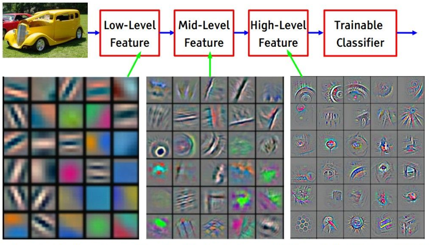
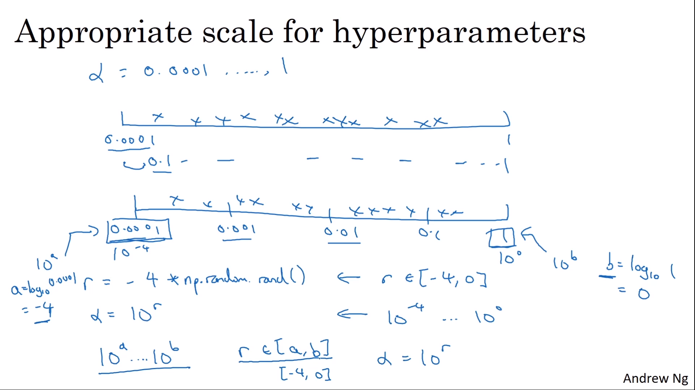

# 스터디 3주차

- [Lecture 5](#lecture-5)
- [Lecture 6](#lecture-6)

## Lecture 5

#### `세연` `p31` 내적할 때 또 벡터 일자로 펴서 곱하는 거면 기존의 일자로 펴서 한 거랑 뭐가 다른지 모르겠습니다. convolution layer 이용하면 좋은 이유가 무엇인지 궁금합니다. filter 여러 개 만들어서 계층적 학습을 할 수 있다는 점? 인가요?

우선은 convolution layer를 이용하여 학습을 하면 좋은 점은 이미지의 특징을 뽑기 좋다는 것이다. filter 하나가 하나의 특징이라 가정을 하면 이걸 sliding함으로써 그 필터만이 특징짓는 특징을 뽑는 것이다. 위의 그림은 feature를 visualization을 한 것인데 여러 개의 필터를 둠으로써 `ㅡ` edge, `|` edge 등 여러 개의 feature를 추출할 수 있다는 것이다. 그리고 이렇게 더 깊게 layer를 둠으로써 더 복잡한 feature들을 추출할 수 있게 되는 것이다.

그럼 내적할 때 벡터로 일자로 곱하는 거면 기존 것과 무엇이 다르냐? 기존 머신러닝 때는 이미지 자체를 하나의 벡터로 나열해서 계산을 했다. 즉, 이미지 자체의 구조가 깨지는 것이다. 하지만 convolution 같은 경우 3*3 혹은 5*5로 하여서 이미지의 구조적 특징을 파악하고 이미지의 특징을 뽑을 수 있게 되는 것이다. 이제 다만 내적을 할 때는 벡터 내적을 해야하므로 그 부분을 벡터로 만들어서 하는 것이다. 계산만 그럴 뿐이다.

#### `세연` `p37` edge, corner, blob 각각 정확히 어떻게 정의된 것들인지 모르겠습니다.

edge는 선, corner는 모서리, blob은 덩어리로 보면 된다. 즉, 얕은 layer에서는 edge와 같은 비교적 단순한 피처들을 추출하고 이걸 바탕으로 깊은 layer로 갈수록 corner, blob과 같은 더 복잡한 피처를 추출한다고 보면 된다.

#### `혜지` `p67` conv layer 처럼 슬라이딩을 하는 게 아니라 특정 부분에만 연결되어 있다는 말이 이해 안 감

해당 슬라이드는 뇌의 neuron과 비교하는 것인데 다음과 같다.

- 뇌의 neuron : 입력값을 모두 받아서 weight를 곱해서 출력
- conv의 neuron : 입력값의 일부(local connectivity)를 받아서 weight(filter)를 곱해서 출력

 

## Lecture 6

#### `혜지` `p21` 왜 오른쪽 아래로 내려가는 기울기가 최적 W 업데이트일까

#### `소현` `p21` W가 다 양수일 때 왜 w에 대한 기울기가 왜 항상 양수거나 음수인가요? 그리고 오른쪽에 지그재그로 되어 있는 부분이 이해가 잘 안 갑니다. 약간 직관적인 설명을 위해서 그렇게 그려놓은 것 같은데 이게 왜 모두 양수일 때랑 무슨 연관이 있는지 궁금합니다.

일단 W에 대한 local gradient는 기본적으로 x이다. 그럼 x가 모든 양수이면 위에서 내려오는 upstream이 양수 또는 음수 일 때 여기에 x를 곱하게 되면 모두 양수 또는 모두 음수이므로, 업데이트 방향이 항상 같다는 것이다. weight의 업데이트가 모두 증가하거나 모두 감소하거나 이런 식이라는 것이다.

오른쪽의 그림은 w1, w2를 축으로 하여 만든 이차원 평면이다. w1과 w2는 모두 같은 방향으로만 업데이트 된다는 것이다. w1이 증가하면 w2도 증가하고, w1이 감소하면 w2도 감소한다는 것이다.

그래서 예를 들어 w1과 w2의 초기값이 모두 0이라고 가정하자. (여기서도 그런 듯) 거기서 거기서부터 업데이트를 하기 시작한다고 한다면 w1과 w2는 모두 증가하거나 모두 감소하거나 둘 중 하나이므로 1사분면과 3사분면으로 기울기가 가리킬 것이다. (그 쪽으로 방향이 향한다는 말)

그런데 여기서 파란색 화살표의 끝 점이 최적의 w1, w2값이라 가정하면 이건 어떻게 업데이트가 될까라는 말이다! 자세히 보면 빨간색 화살표가 완벽한 수직? 이 아니고 즉, 기울기가 0이거나 inf가 아니고 살짝 기울어진 것을 볼 수 있다. 즉, 3사분면이나 1사분면의 방향으로만 update가 되기에 삥삥 돌아서 온다는 말이다.

#### `혜지` `p24` 왜 RELU함수는 – 값을 다 버릴까?

relu의 공식은 max(0, x)로 출력값이 0보다 크면 해당 값을 그냥 흘려보내고 아니면 0으로 하는 것이다. 그래서 음수 값을 버리게 된다. 애초에 음수가 나오는 출력값은 버리겠다는 것.

relu는 생물학적으로 봤을 때 활성화 값을 넘으면 자극을 보내고 아니면 안 넘은면 자극을 안 보내는 것

#### `재용` `p27` dead relu 설명에서 빨간색 선, 초록색 선은 어떻게 해석하는거지?

화살표가 가리키는 방향이 활성화가 되는 부분인데 이제 선을 지나면 활성화가 된다는 말이다.

초록색의 relu의 경우 (어떤 layer를 지나고 출력값이 나왔다는 상황을 가정) relu가 초록색 선 밖에 있는 부분이 활성화 되다는 것이고 빨간색 relu의 경우 layer를 지나보니 거의 다 음수가 나와서 결국에는 그 다음 layer에 전해지는 값이 다 0이라는 것이다.

즉 결국에는 아무것도 활성화 되지 않는 다는 말.

#### `세연` `p28` input이 0보다 작을 때 dead ReLU인 것이 아닌지, dead/active ReLU 영역의 차이를 모르겠습니다.

출력값이 나왔을 때(wx) 후에 이걸 relu에 넘겨서 양수이면 다음 layer에 넘기고 안 넘으면 그냥 0으로 한다는 말.

#### `세연` `p31` ELU 출력값이 거의 zero centered 라는 걸 봤는데 맞는지, zero centered 의미가 무엇인지 정확히 모르겠습니다. / closer to zero mean; zero mean 의미가 무엇인지 모르겠습니다. 위의 zero centered와 같은 맥락인가요?

평균이 0이라는 말. 즉, 활성화 함수(sigmoid, relu)등을 지나고 나서 활성화 값들의 분포를 보면 0이 중심에 있다는 것이다. 예를 들어, [1, 2, 4, 5]라는 값들의 분포가 있다면 이것들의 중심은 대략 3이라 생각할 것이다. 다른 예로 tanh 함수를 봐보자. 출력값을 tanh를 지나게 되면은 해당 값을 tanh의 y값인 [-1, 1]에 분포를 하게 된다. 그 값들을 보고 중간을 찾으면은 0에 있다는 것이다.

closer to zero mean이라 하는 것은

closer to zero mean이라는 말은 elu의 경우 위에 처럼 분포 내고 평균 내면 0이 아니라 조금 0에 가깝게 된다는 것이다. relu의 경우 그래프 자체가 0을 통과하지 않기에 zero-centered 될 수가 없다.

#### `세연` `p36` input이 항상 양수일 때 w가 모두 양수/모두 음수가 되는 이유와 이것이 zero mean data와는 무슨 관련이 있는지 모르겠습니다.

zero centered가 되지 않다는 말은 그래프 모양이 relu나 sigmoid와 같이 모두 양수같은 함수라는 것이다. 이렇게 되면 가장 큰 문제점은 앞서 언급했듯이 "weight 업데이트가 동일 방향으로 된다는 것"이다. weight가 증가하는 방향으로 업데이트 하면 모두 그렇게 업데이트가 되고, 감소하면 다 감소하는 방향으로 업데이트 된다는 것이다.

즉 weight가 다양한 방향으로 업데이트 되기 위해서는 활성화 함수가 중요하다는 것이다. 이 활성화 함수가 zero centered가 되어 있지 않으면은 같은 방향으로만 업데이트가 될 것이니 말이다.

#### `소현` `p37` nomalized와 zero-centered의 차이. zero-centered는 평균이 0에 있는 거고 normalized는 표준편차가 1인 것 까지 고려를 하는 것인가요? nomalized가 잘 되어 있다는 말이 정확히 무엇인가요?

zero centered와 normalization의 공통점은 평균이 0이라는 것이고 normalization은 정규화 즉 값까지 0과 1사이의 값들로 만드는 것이다.

#### `소현` `p48` 출력값이 distibuted한 게 왜 좋을까요? CNN과 연관지어서 생각해보려니까 더 잘 안 되는 것 같은데.. 일단은 weight값을 각각에 맞추어 업데이트하기 위해서라는 생각이 들기는 합니다. 만약에 출력값이 모두 같다면 weight값들이 다 동일한 크기만큼 업데이트 될 테니까요. 이것은 결국에 신경망 학습의 이점을 상쇄시키는 거라 생각이 드는데 맞나요?

해당 plot은 각 layer를 지났을 때의 활성화 함수 결과 값들이다. 이게 활성화 함수 결과가 나오고 끝나는게 아니라 이게 또 다른 layer의 입력값이 되기 때문에 이게 distributed한게 중요한 것이다. 그래야 그 다음 layer의 weight값들도 잘 업데이트 될 수 있기 때문이다.

#### `세연` `p48-51` 47p까지는 이해가 되는데 그 이후로는 그래프를 잘 이해하지 못했습니다. 이후 슬라이드에서 성능이 좋아진 걸 어떻게 해석하는지, 평균, 표준편차 그래프 의미가 궁금합니다

`p48`은 잘 된 경우이다. Xavier 초기값을 써서 잘 분포가 되어 있는 경우이다. 근데 Xavier 초기값의 경우 활성화 함수가 Relu일 경우 잘 되지 않는다. 왜냐하면은 활성화 함수가 선형 함수라고 가정하고 한 초기값이기 때문이다.

그래서 relu를 위한 weight 초기값으로 He초기값이 있는데 이것은 비선형적인 활성화 함수에 딱 알맞은 초기값이다. `p49` 는 Xavier 초기값이고 Relu가 활성화 함수 일때의 각 layer마다 활성화 값 분포도를 나타낸 것이다. 처음에 보면 대부분의 값이 0이 되어 있는데 즉, 절반이 죽은 것이다. 그러고 나서 layer가 점점 더 깊어질 수록 활성화값이 더 0으로 몰리는 상황을 볼 수 있다.

`p50` 은 He 초기값을 써서 하는 것인데 그래프를 보면은 layer가 깊어져도 어느 정도 분포를 유지하는 것을 볼 수 있다. relu를 쓰기 때문에 절반이 0으로 몰리는 상황은 어쩔 수 없다.

어쨌든 `p50` 과 `p49` 를 비교하면 된다.

#### `혜지` `p59` identity mapping이 뭐지?

입력이 들어오면 그냥 그대로 출력으로 내보는 것이다. 여기서 identity mapping이라는 말이 나온 것은 batch normalization을 하고 나서 다시 복구한다고 했는데 그게 결국에는 그대로 입출력하는 게 아니였냐는 질문이 여기서 나온 것 같다.

#### `소현` `p71` 결국에 20%까지 찍은 이유가 무엇인가요? 이 부분 설명이 잘 이해가 안갔습니다.

CIFAR10 데이터를 가지고 학습을 하는 것인데 여기서 softmax로 각 클래스일 확률을 뽑는데 이게 다 고만고만해서 (예를 들어 다 비슷하게 10%)라고 생각. 그래서 cost는 비슷비슷한 것이고 근데 accuracy의 경우 확률이 큰 걸 맞다고 하기 때문에 학습하면서 조금 확률이 올랐는데 맞아서 accuracy가 맞았다!고 해서 저렇게 가끔 팍 오르기도 함. 어쨌든 학습하는 방향으로 가니까 추세를 보면 정확도가 오르는 방향으로 간다.

#### `소현` `p77` log space로 optimization한 다는 게 무슨 말인가요.

`0.0001 - 1` 사이에서 learning rate를 정한다고 할 때 우리가 구하는 learning rate는 `0.0001 - 0.1` 에 분포하기 때문에 우리가 그 값을 볼 확률은 10%이다. 즉 무작위로 learning rate를 뽑는다고 했을 때 우리가 뽑을 확률이 10%라는 것은 매우 비효율적이다.

그래서 그렇게 하지 않고 `0.0001 - 0.001` , `0.001 - 0.01` , `0.01 - 0.1` , `0.1 - 1` 구간이 있다고 할 때 해당 구간을 동일한 확률로 살펴보는 것이 더 효율적일 것이다. 그러므로 우리는 10의 차수로 하이퍼파라미터를 조정하는 것이다. 그렇게 되면 각각의 구간에서 하이퍼파라미터를 선택할 확률이 동일하기 때문이다.

다른 의미로는 +, -로 값을 조정하는 것은 결과에 큰 영향을 끼치지 않고 /,_로 값을 조정하는 것이 직관적으로 결과에 큰 영향을 끼치기에 그렇게 하이퍼파라미터를 조정한다고 생각할 수도 있다. 즉, +, -는 linear scale 단위로 /,_ 은 log scale단위로 튜닝을 하는 것이다.

[Why does one sample the log-space when searching for good Hyper Parameters for Machine Learning?](https://www.quora.com/Why-does-one-sample-the-log-space-when-searching-for-good-Hyper-Parameters-for-Machine-Learning)

#### `소현` `p80` 그래프가 이해가 안됩니다ㅠㅠ 추가로 cross validation이라 함은 머신러닝 때 kfold방식이나 이런 걸로 교차 검증을 했었는데 여기서는 손수 범위를 제가 직감적으로 때려 잡아서 튜닝하는 걸 말하나요.

parameter가 두 개이다. 근데 한 parameter는 중요하고 한 parameter는 중요하지 않다. 그리고 초록색 노랑색 그래프가 정확도라 할 때 이는 확실히 보인다. 그래서 우리는 중요한 parameter를 기준으로 정확도가 높은 값을 찾게 되는데 grid layout은 그림을 보면 3개 밖에 탐색을 하지 못한다. 그러므로 random으로 탐색을 하게 되면 여러 부분 탐색하면서 좀 더 정확도가 높은 값을 찾을 수 있다.
