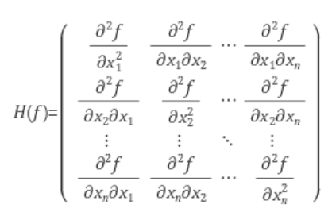
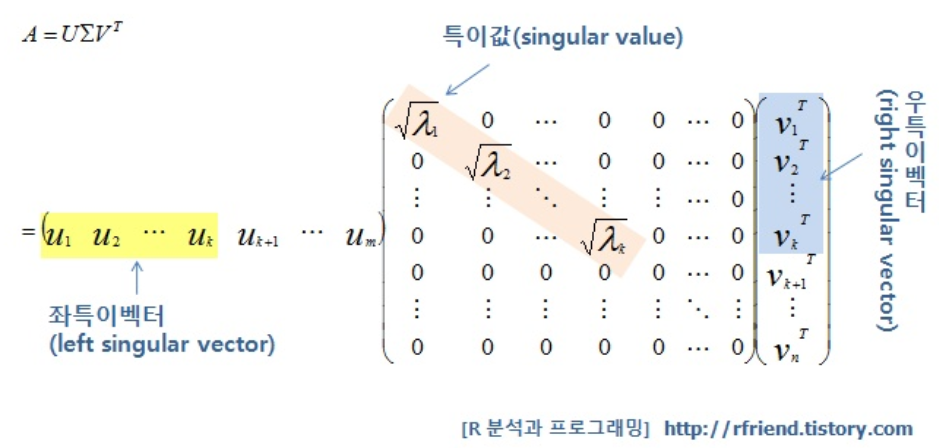

# 스터디 4주차

## Lecture 7

#### ✅ `혜지` `p15` condition number가 뭐지?

Hessian Matrix의 최대/최소 singular values 값의 비율. 거기까지 가려면 SVD나 이쪽을 더 찾아봐야할 듯 하다.

SVD를 통해서 Hessian Matrix를 다음과 같이 분해할 수 있다.

이게 특이값을 분해하는 과정인데 저 특이값이 가장 큰 것과 가장 작은 것의 비율이 클 경우 안 좋다고 하는 듯 하다.

보통 크면 taco 같이 생긴 모양이 나온다고 한다.

#### ✅ `세연` `p15` taco shell이 어떤 모양인지? 저 원 여러 개 있는게 수평 원이고, 지그재그 선의 위아래 방향은 원에 수직인건지?

이게 taco shell인데 이렇게 생긴 것을 말한다. 지그재그 선 위아래는 이게 중간 부분이 global minimum이라 하면 어쨌든 거기로 수렴은 하겠지만은 수평(뚫여있는것) 부분은 둔감하기 때문에 거기서 거의 업데이트가 되지 않고 수직부분(막힌 부분)이 민감하기에 거기에 업데이트가 자주 일어난다. 그래서 지그재그 모양이 되는 것.

#### ✅ `소현` `p20` explicit stochasticity가 무슨 말인지 모르겠습니다. 네트워크의 explicit stochasticity로 인해 노이즈가 발생할 수 있다는 것인데 이게 정확히 무슨 말인지 궁금합니다.

[What Does Stochastic Mean in Machine Learning? - Machine Learning Mastery](https://machinelearningmastery.com/stochastic-in-machine-learning/)

> Many machine learning algorithms are stochastic because they explicitly use randomness during optimization or learning.

애초에 머신러닝이든 딥러닝이든 stochastic 즉 random함은 기저에 깔고 들어간다. 그로 인해 noise가 실제랑 값이 차이나는 그런 현상이 일어날 수 밖에 없다.

학습을 할 때 생각해보자 input이 들어오기 전까지 어떤 파라미터든 간에 정해진 것은 없다. 학습을 하면서 즉 input이 들어오면서부터 값이 정해지기 시작한다. 또한 같은 input데이터라도 딥러닝 혹은 머신러닝이 추구하는 방향에 따라서 값이 달라질 수 있다. 이런 것들 때문에 stochastic하다라는 말이 나온 것 같다.

#### ✅ `소현` `p22` 이 말에서 마지막 부분이 이해가 가지 않습니다.

> “문제는 어떻게 SGD Momentum이 poorly conditioned coordinate 문제를 해결할 수 있는지 입니다. 우선 velocity estimation term에서 velocity가 어떻게 계산되는지를 보면 gradient를 계속해서 더해갑니다. 이는 하이퍼파라미터인 rho에 영향을 받습니다. 그리고 현재 gradient가 상대적으로 작은 값이고 그리고 이 상황에서 rho가 적절한 값으로 잘 동작한다고 하면 velocity가 실제 gradient보다 더 커지는 지점까지 조금씩 증가할 것입니다.”

`rho*vx + dx` 인데 어느 정도 잘 작동하면은 velocity의 영향력이 gradient의 영향력보다 커지게 된다. 그래서 local minima에서도 빠져나올 수 있게 하는 것.

#### ✅ `소현` `p24` exponentially weighted moving average와 “이전 기울기가 시간이 지날수록 기하급수적으로 감소한다”라는 말이 이해가 되지 않습니다.

momentum에서 현재 속도에다가 rho를 곱하고 gradient를 곱해주는데 그 다음 거를 또 곱하고 곱하고 하면은 이전 값들은 rho^n 더 곱해져서 기하급수적으로 감소한다.

#### ✅ `재용` `p25` 알파값이 음수인가?

alpha는 하이퍼파라미터 learning rate를 말한다.

#### ✅ `세연` `p31` saddle point(non convex)일 때 AdaGrad 쓰면 안 되는 이유가 grad_squared 항 때문이라면 convex일 때 local minima는 어떤지? AdaGrad가 convex에서는 잘 작동한다고 했는데 local minima는 예외인건지?

convex하다는 말은 global minimum이 하나인 경우이다. 그러기에 global minimum이 하나이기 때문에 Adagrad를 써도 큰 상관이 없다. 하지만 convex하지 않을 경우 여러 개의 극점이 있어서 local minimum이 여러개인 경우 Adagrad는 Momentum과 같이 밀어주는 힘이 없기 때문에 local minimum이 global minimum이면 좋겠지만은 아닐 경우 거기에서 gradient가 점점 0으로 수렴하여 거기서 학습이 끝나버릴 수 있기 때문이다.

#### ✅ `소현` `p38` 손실함수가 기울어진 타원형일 경우라 하는데 이게 정확히 어떤 모양인지 헷갈립니다. 일단 등고선을 그렸을 때 타원형인데 이게 한 쪽으로 기울어진 꼬깔콘이라 보면 될까요?

타원이 회전되었을 때 x, y축 조금 회전된 건 경우 축에 대한 회전을 하기 때문에 실제 학습 때 문제가 될 수 있다.

#### ✅ `재용` `p48` 수식이 어떻게 유도된거지?

[Math Insight : Taylor Theorem Multivariable Introduction](https://mathinsight.org/taylors_theorem_multivariable_introduction)

#### ✅ `혜지` `p52` stochasticity가 낮은 경우가 뭐지?

랜덤 확률이 낮은 경우. 값이 정해져 있다? 어느 정도 정해져 있다? 이런 말인 것 같음.

#### ✅ `재용` `p56` snapshot이 뭐지?

snapshot은 100번 학습하고 학습한 애를 따로 저장하고. (checkpoints)에 저장. 학습하는 중간에 모델을 저장했다가 마지막에 저장해둔 것 중에 좋은 걸 가져다 쓴다.

#### ✅ `소현` `p62` dropout이 어떻게 보면 서브네트워크와의 앙상블이라 본다고 했는데 “서브네트워크 앙상블을 동시에 학습시킨다” 이 말이 이해가 안갑니다.

drop out을 하면 몇몇 노드를 없애다 보면 다양한 서브 네트워크가 나오는데 이것들 여러 개로 학습하니까 같은 효과를 낸다.

보통 모델 앙상블을 한다고 하면 한 모델의 학습이 끝나고 또 다른 모델의 학습을 하고 마지막에 앙상블을 하는데 dropout의 경우 학습을 진행하면서 여러 개의 서브네트워크를 만나기 때문에 동시에라는 말이 나온 것 같다.

#### ✅ `세연` `p62` 상호작용을 줄여서 overfitting 막는 것까진 이해가 되는데 그걸 랜덤으로 하면 중요한 관계를 놓칠 수 있는 것 아닌지 궁금합니다. 랜덤으로 만든 서브 네트워크를 여러 번 만들어서 평균을 내면 완화되니까 괜찮은 것인가요?

전체 이미지에 대한 데이터니까 전체 특징이 날라가지는 않는다.

#### ✅ `혜지` `p71` Dropout을 사용하면 왜 학습시간이 늘어날까?

[Why does dropout increase the training time per epoch in a neural network?](https://stats.stackexchange.com/questions/376993/why-does-dropout-increase-the-training-time-per-epoch-in-a-neural-network)

dropout을 하게 되면 추가적인 연산을 요구하기 때문이다. 예를 들으면 dropout mask나 그 mask에 weight를 곱하는 것이나 그런 추가 적인 연산이 동반되기 때문에 더 느린 것이다.

#### ✅ `세연` `p82` [train time에는 stochasticity가 추가되고 test time에는 marginalize out 되기 때문이죠.] 이게 무슨 뜻인지 잘 모르겠습니다. 아마 marginalize out 의미를 확실히 몰라서 그런 것 같은데 소외되다? 무시된다? 그런 의미라면 왜 그런 것인지 모르겠습니다. train 때만 입력에 변화를 주고 실제 test 때는 입력 데이터에 변화를 안준다 그런 뜻인가요?

맞다.

#### ✅ `세연` `p85` stochastic depth와 dropout의 차이를 잘 모르겠습니다.

stochastic depth는 layer를 버리고, dropout은 node를 버리는 것. stochastic depth같은 경우 모델의 깊이가 많이 깊을 경우 해당 방법을 쓰면 성능이 올라갈 수 있다고 한다.

#### ✅ `세연` `p87` [Transfer learning은 "CNN 학습에는 엄청 많은 데이터가 필요함" 이라는 미신을 무너뜨려버립니다.] 라는 말이 잘 이해가 안됩니다. 그 다음 과정을 보니 처음에 아주 큰 데이터셋을 써야하는데, imagenet 같은 건 그냥 기본적으로 있다고 가정해서 그런그런 것인지 궁금합니다.

간단히 이야기하면 기존에 잘 학습된 모델을 가지고 쓴다는 말입니다. 즉 저희가 할 것은 기존에 잘 학습된 모델은 조금 수정하거나 중간의 hidden layer만 싹 뽑아내서 쓴다는 말인 것이죠.

그래서 큰 데이터가 필요 없다는 말입니다. 이미 잘 학습되어 있는 모델을 쓰기 때문에.

#### ✅ `혜지` `p90` 기존가중치들이 이미 잘 학습되어 있으면 lr 높여야 하는 것 아닌가?

이미 성능이 보장되어 있기 때문에 가중치를 조금만 내 데이터셋에 맞게 수정하면 되기 때문에 learning rate를 작게 하는 것.
